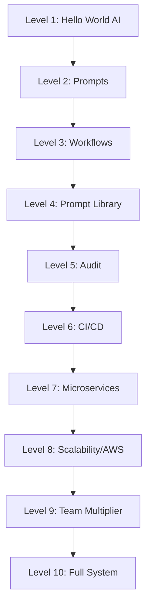

# 🎮 AI Engineering Bootcamp

> 10 levels to master AI-assisted development with VS Code + GitHub Copilot.
> 23 hands-on projects. From zero to production-ready workflows.

## Why this exists

AI changed how we write code. But most developers learn by trial and error — no structure, no methodology, no audit. This bootcamp gives you a **progressive, gamified path** from "accepting autocomplete suggestions" to "orchestrating AI agents in production."

Originally created to prepare for an **AI-Driven Engineering Specialist** role. The methodology is transferable: VS Code + Copilot as the equivalent of Cursor/Claude Code.

## How to use this

- Each level unlocks the next
- Each level has 1-4 hands-on projects
- Mark your progress by changing `[ ]` to `[x]` in each project
- Complete the self-review before advancing to the next level

## Progress table

| Level | Name | Status | Projects |
|-------|------|--------|----------|
| 1 | Hello World with AI | ⬜ Pending | 2 |
| 2 | Prompts That Work | ⬜ Pending | 2 |
| 3 | Structured Workflows | ⬜ Pending | 2 |
| 4 | Prompt Library | ⬜ Pending | 3 |
| 5 | AI Code Audit | ⬜ Pending | 2 |
| 6 | CI/CD with AI | ⬜ Pending | 2 |
| 7 | Microservices | ⬜ Pending | 2 |
| 8 | Scalability / AWS | ⬜ Pending | 3 |
| 9 | Team Multiplier | ⬜ Pending | 3 |
| 10 | Full System | ⬜ Pending | 2 |

**Total: 23 hands-on projects**

## Tool mapping

This bootcamp uses **VS Code + GitHub Copilot** as the equivalent of Cursor/Claude Code. See [tool-mapping.md](docs/tool-mapping.md) for the complete comparison.

## Prerequisites

- VS Code installed
- GitHub Copilot activated (free tier or trial works)
- Node.js 18+
- Basic JavaScript knowledge (variables, functions, async/await)

## Quick start

```bash
# 1. Clone the repo
git clone https://github.com/gonzoblasco/ai-engineering-bootcamp
cd ai-engineering-bootcamp

# 2. Start with Level 1
open docs/level-01-hello-world.md
```

## Levels overview



## Job role coverage

| Requirement | Level(s) |
|---|---|
| AI workflow design | 3, 4, 9 |
| Prompt libraries & templates | 4, 9 |
| Audit AI-generated code | 5 |
| CI/CD integration | 6 |
| Mentor engineers | 9 |
| Fullstack JS/TS + Node.js | 1–7 |
| API & microservices | 3, 7 |
| AWS / cloud-native | 8 |
| Scalability, performance, security | 8 |

## Related projects

- [Kanam Workflow Kit](https://github.com/gonzoblasco/workflow-kit) — Portable AI agent workflow skills (commit, PR, review, security audit)

## License

MIT — do whatever you want with the code.
