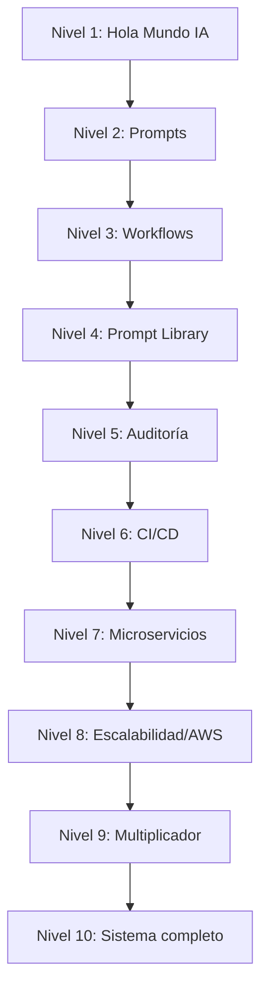

# 🎮 AI-Driven Engineering Specialist — Roadmap

> Plan de 10 niveles para dominar el desarrollo asistido por IA usando VS Code + GitHub Copilot como equivalente a Cursor/Claude Code.

## Contexto

Preparación para postulación como **AI-Driven Engineering Specialist (Cursor Expert)** en Trafilea.

El puesto pide Cursor o Claude Code, pero la metodología es transferible a VS Code + Copilot.

## Cómo usar este documento

- Cada nivel desbloquea el siguiente
- Cada nivel tiene 1-4 proyectos prácticos
- Marca tu progreso cambiando `[ ]` por `[x]` en cada proyecto
- Al final de cada nivel, haz un self-review antes de avanzar

## Progreso general

| Nivel | Nombre | Estado | Proyectos |
|-------|--------|--------|-----------|
| 1 | Hola Mundo con IA | ⬜ Pendiente | 2 |
| 2 | Prompts que funcionan | ⬜ Pendiente | 2 |
| 3 | Workflows estructurados | ⬜ Pendiente | 2 |
| 4 | Prompt Library | ⬜ Pendiente | 3 |
| 5 | Auditoría de código IA | ⬜ Pendiente | 2 |
| 6 | CI/CD con IA | ⬜ Pendiente | 2 |
| 7 | Microservicios | ⬜ Pendiente | 2 |
| 8 | Escalabilidad/AWS | ⬜ Pendiente | 3 |
| 9 | Multiplicador de equipo | ⬜ Pendiente | 3 |
| 10 | Sistema completo | ⬜ Pendiente | 2 |

**Total: 23 proyectos prácticos**

## Cobertura de requisitos del puesto

| Requisito Trafilea | Nivel(es) |
|---|---|
| AI workflow design | 3, 4, 9 |
| Prompt libraries & templates | 4, 9 |
| Audit AI-generated code | 5 |
| CI/CD integration | 6 |
| Mentor engineers | 9 |
| Fullstack JS/TS + Node.js | 1–7 |
| API & microservices | 3, 7 |
| AWS / cloud-native | 8 |
| Scalability, performance, security | 8 |

## Mapa del camino



## Estructura de documentación

```
docs/
├── README.md                    ← Este archivo (índice general)
├── cursor-vs-vscode.md          ← Mapeo de herramientas
├── level-01-hola-mundo.md
├── level-02-prompts.md
├── level-03-workflows.md
├── level-04-prompt-library.md
├── level-05-auditoria.md
├── level-06-cicd.md
├── level-07-microservicios.md
├── level-08-produccion.md
├── level-09-multiplicador.md
└── level-10-dios.md
```